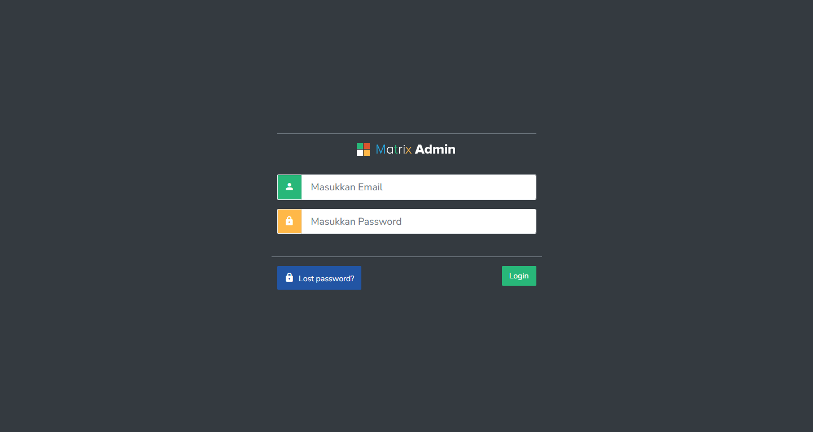

# Toko Online

<p align="center"></p>
<p align="center"></p>

## 🚀 Pengenalan Project

Project ini merupakan implementasi E-Commerce berbasis Laravel yang dikembangkan untuk mata kuliah Web Programming II di Universitas Bina Sarana Informatika. Aplikasi Toko Online ini menyediakan platform lengkap untuk manajemen produk, kategori, dan pengguna dengan antarmuka yang intuitif dan responsif.

**Developed by: Hosea Oktarivanes | 17220987**

## 📊 Arsitektur Database
<p align="center"></p>

Sistem ini dibangun dengan struktur relasional yang komprehensif untuk mendukung seluruh operasional toko online, termasuk manajemen produk, kategori, pengguna, dan transaksi.

## ⚙️ Prasyarat Sistem
Sebelum menginstall, pastikan sistem Anda telah memenuhi kebutuhan berikut:

- [x] Git
- [x] Composer
- [x] Code Editor `VS Code, Sublime Text atau sejenisnya`
- [x] Web Server `Laragon, XAMPP atau sejenisnya`
- [x] Web Browser `Chrome, Firefox atau sejenisnya`
- [x] Node.js `(opsional)`

## 🔧 Panduan Instalasi

### 1. Clone Repository
```bash
git clone https://github.com/SirHosen/TokoOnline-Laravel.git
```

### 2. Install Dependensi
Buka project menggunakan Code Editor, lalu jalankan perintah berikut pada terminal:
```bash
composer install
```

### 3. Konfigurasi Environment
Duplikat file `.env.example` menjadi `.env` dan sesuaikan konfigurasi database:
```
DB_CONNECTION=mysql
DB_HOST=127.0.0.1
DB_PORT=3306
DB_DATABASE=db_tokoonline
DB_USERNAME=root
DB_PASSWORD=
```

### 4. Generate Application Key
```bash
php artisan key:generate
```

### 5. Setup Storage Link
```bash
php artisan storage:link
```

### 6. Migrasi Database dan Seeding
```bash
php artisan migrate:fresh --seed
```

### 7. Jalankan Server
```bash
php artisan serve
```

## 🖥️ Fitur Utama

- **Manajemen Pengguna**: Sistem role-based untuk admin dan pelanggan
- **Katalog Produk**: Pengelolaan produk dengan multiple image
- **Kategori**: Pengorganisasian produk berdasarkan kategori
- **Laporan**: Generasi laporan user dan produk
- **Responsive Design**: Antarmuka yang responsif untuk berbagai perangkat

## 📸 Screenshot Aplikasi

<table width="100%">
<tr>
<td><h3 align="center">🔠Login</h3></td>
<td><h3 align="center">🠠Dashboard</h3></td>
</tr>
<tr>
<td><h3 align="center">👤 Manajemen User</h3></td>
<td><h3 align="center">🏷️ Kategori Produk</h3></td>
</tr>
<tr>
<td><h3 align="center">📦 Manajemen Produk</h3></td>
<td><h3 align="center">🖼️ Galeri Produk</h3></td>
</tr>
<tr>
<td><h3 align="center">📊 Laporan User</h3></td>
<td><h3 align="center">📈 Laporan Produk</h3></td>
</tr>
</table>

## 🛠️ Teknologi yang Digunakan

- **Backend**: Laravel 8
- **Frontend**: Bootstrap 4, jQuery
- **Database**: MySQL
- **Authentication**: Laravel Fortify
- **PDF Generation**: DomPDF

## 📜 Lisensi

Project ini mengacu pada modul praktik dari mata kuliah Web Programming II Universitas Bina Sarana Informatika (UBSI). Project ini bersifat open-source untuk tujuan edukasi.

---

<p align="center">
  
  <br>
  <strong>Kuliah...? BSI AJA !!</strong>
</p>

<p align="right">
  <i>Developed with ❤️ by Hosea Oktarivanes | 17220987</i>
</p>
